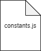

# CONFIG

The config folder contains configuration files intended to be used throughout the app. A typical example of a configuration file is a “constants” file where app constants are stored.

### Sample folder structure for CONFIG

\
