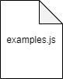

# DIRECTIVES

The directives folder contains Vue js custom directives. Directives are tiny commands that you can attach to DOM elements. They are prefixed with v- to let the library know you're using a special bit of markup and to keep syntax consistent. They are typically useful if you need low-level access to an HTML element to control a bit of behavior.
More information about directives in [the documentation](https://vuejs.org/v2/guide/custom-directive.html).

### Sample folder structure for DIRECTIVES

\
