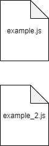

# FILTERS

The filters folder contains Vue js custom filters.
More information about filters in [the documentation](https://vuejs.org/v2/guide/filters.html).

### Sample folder structure for FILTERS

\
