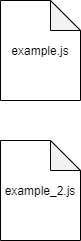

# HELPERS

The helpers folder contains custom reusable blocks of code that perform simple computational operations. A typical example of a helper would be a function that converts a JSON object to FormData.

### Sample folder structure for HELPERS

\
